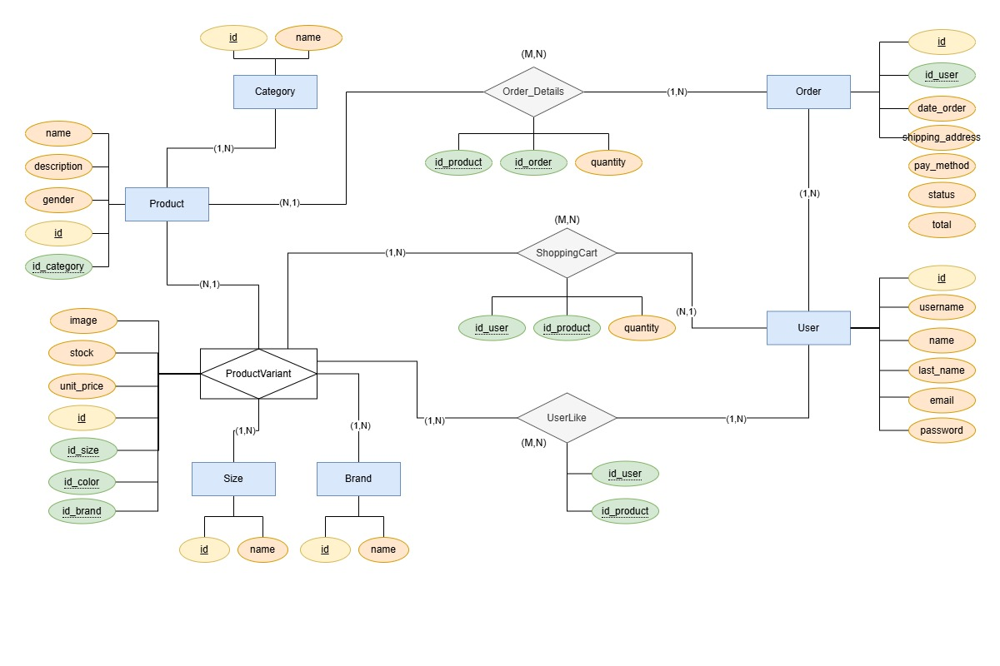
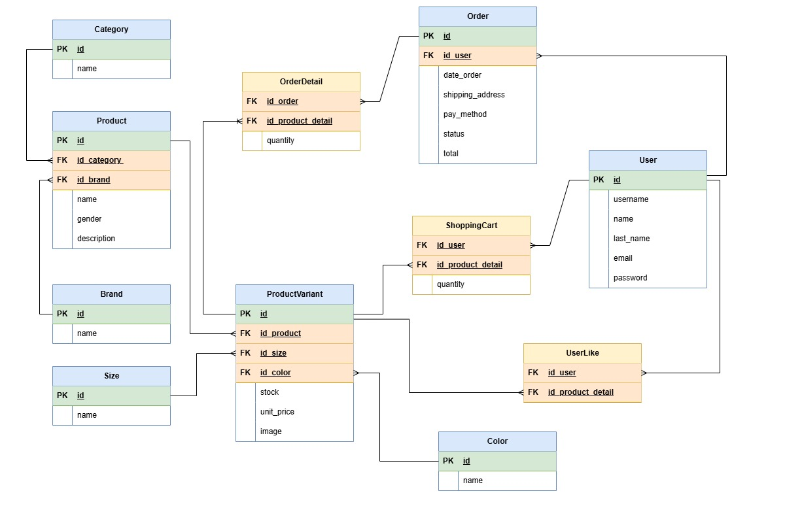

**_215833 - ALEJANDRO CAMPA ALONSO_**

# Project's name: KIX THREADS System

## System's description:
Kix Threads is a web app built in Django that allows users to buy different sizes and brands clothes or shoes. The systems offers functionalities for both users and administrators, including: serching for a visual catalog, shopping cart, order management, and user management. The administrator has access to products, brands, sizes, categories, orders, users management.

## Actors involved:
- **System administrator:** responsible for managing the product catalog (CRUD), including brands, sizes, categories, orders and products.
- **Client/Customer:** can register, login, search for products, give "likes", add products to the shopping cart, make orders, and view their orders.
- **Database:** stores all the information of the system: products, users, orders, cart, llkes, etc.
- **Web system (backend Django):** manages the business logic of the system, CRUD operations and validations.
- **Web interface (frontend):** shows to customers the information with any type of devices.

## Functional requirements:
| **ID** | **Description** |
| --- | --- |
| FR-01 | The admin can create, read, update and delete products from the catalog. |
| FR-02 | Each product can be associated to one or several sizes with their respective stock. |
| FR-03 | Users can register and log their profile. |
| FR-04 | User will be able to add products to the cart specifying size and quantity. |
| FR-05 | The system will check the available stock before allowing to add a product to the cart. |
| FR-06 | Users will be able to generate an order from the contents of their cart. |
| FR-07 | Each user will be able to consult a history of their orders. |
| FR-08 | The system will display the products with image, description, price, brand and size available. |
| FR-09 | Users can filter products by brand, size and category. |
| FR-10 | Users will be able to mark products as favorites. |
| FR-11 | Each user will be able t access a list of products they have marked as favorites. |

## Non-functional requirements:
| **ID** | **Description** |
| --- | --- |
| NFR-01 | The system will be developed with Django 5.2 and will use SQLite as the database under development. |
| NFR-02 | A defined identity will be applied with specific colors and fonts (red: #E63945, black: #1D1D1D, white: #F1FAEE, gray: #A8A8A8, titles: Bebas Neue-Oswald and general text: Roboto-Lato). |
| NFR-03 | The interface will be responsibe, working correctly on mobile and desktop. |
| NFR-04 | Specific error messages will be displayed (e.g. "insufficient stock", "invalid mail"). |
| NFR-05 | Visual confirmations will be included for key actions (e.g., remove from the cart). |

**_Database model_**

